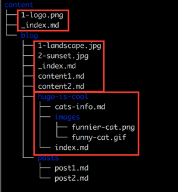

+++
title = "内容组织"
weight = 1
date = 2023-05-18T17:03:08+08:00
description = ""
isCJKLanguage = true
draft = false
+++

# Content Organization - 内容组织 

[https://gohugo.io/content-management/organization/](https://gohugo.io/content-management/organization/)

Hugo assumes that the same structure that works to organize your source content is used to organize the rendered site.【好复杂的从句】

​	Hugo 假设用于组织源内容的结构与用于组织渲染站点的结构相同。

## Page Bundles 

​	Hugo `0.32` 引入了页面相关的图像和其他资源封装为`Page Bundles`的功能。

​	这些术语是相关的，您还需要阅读页面资源（[Page Resources](https://gohugo.io/content-management/page-resources)）和图像处理（[Image Processing](https://gohugo.io/content-management/image-processing)）等相关文档才能获得全面的信息。



​	示意图显示了三个bundle。请注意，主页bundle不能包含其他内容页面，虽然允许包含其他文件（如图像）。

> bundle文档仍在完善中。我们会尽快发布更全面的文档。

## Organization of Content Source 

​	在 Hugo 中，您的内容应该按照反映渲染站点的方式进行组织。

​	虽然 Hugo 支持嵌套在任何级别的内容，但顶层（即 `content/<DIRECTORIES>`）在 Hugo 中是特殊的，并且被视为用于确定布局等内容类型。要了解更多有关部分的信息，包括如何嵌套它们，请参阅[sections](https://gohugo.io/content-management/sections/)。

​	在没有任何额外配置的情况下，以下内容将自动工作：

```txt
.
└── content
    └── about
    |   └── index.md  // <- https://example.com/about/
    ├── posts
    |   ├── firstpost.md   // <- https://example.com/posts/firstpost/
    |   ├── happy
    |   |   └── ness.md  // <- https://example.com/posts/happy/ness/
    |   └── secondpost.md  // <- https://example.com/posts/secondpost/
    └── quote
        ├── first.md       // <- https://example.com/quote/first/
        └── second.md      // <- https://example.com/quote/second/
```

## 在 Hugo 中的路径分解 

​	以下示例演示了在 Hugo 渲染站点时，您的内容组织和输出 URL 结构之间的关系。这些示例假定您使用美化的 URL，这是 Hugo 的默认行为。这些示例假设您[正在使用美化的 URL](https://gohugo.io/content-management/urls/#appearance)，这是 Hugo 的默认行为。这些示例还假设在您[站点的配置文件](https://gohugo.io/getting-started/configuration/)中设置了 `baseURL = "https://example.com"`。

### 索引页: _index.md 

​	`_index.md` 在 Hugo 中有特殊的作用。它允许您在[列表模板](https://gohugo.io/templates/lists/)中添加 前置元数据和内容。这些模板包括[section templates](https://gohugo.io/templates/section-templates/)、[taxonomy templates](https://gohugo.io/templates/taxonomy-templates/)、[taxonomy terms templates](https://gohugo.io/templates/taxonomy-templates/)和[homepage template](https://gohugo.io/templates/homepage/)。

> 提示：您可以使用 [.Site.GetPage 函数](https://gohugo.io/functions/getpage/)引用 `_index.md` 中的内容和元数据。

​	您可以为主页和每个内容章节（content sections）、分类法（taxonomies）和分类法条目（taxonomy terms）中创建一个 `_index.md`。以下示例显示了在Hugo站点上包含用于`posts`章节列表页的内容和前置元数据的`_index.md`的典型放置方式：

```txt
.         url
.       ⊢--^-⊣
.        path    slug
.       ⊢--^-⊣⊢---^---⊣
.           filepath
.       ⊢------^------⊣
content/posts/_index.md
```

At build, this will output to the following destination with the associated values:（with该怎么翻译）

​	在构建时，这将输出到以下目标并具有相关的值：

```txt
                     url ("/posts/")
                    ⊢-^-⊣
       baseurl      section ("posts")
⊢--------^---------⊣⊢-^-⊣
        permalink（永久链接）
⊢----------^-------------⊣
https://example.com/posts/index.html
```

​	[sections](https://gohugo.io/content-management/sections/)可以嵌套得很深。要完全导航section树，最下面的section至少必须包含一个内容文件（即`_index.md`） 。

### Single Pages in Sections 

​	在每个章节中的单个内容文件将渲染为[单个页面模板](https://gohugo.io/templates/single-page-templates/)。这是一个在 `posts` 中的单个`post`的例子：

```txt
                   path ("posts/my-first-hugo-post.md")
.       ⊢-----------^------------⊣
.      section        slug
.       ⊢-^-⊣⊢--------^----------⊣
content/posts/my-first-hugo-post.md
```

​	当Hugo构建您的站点时，内容将输出到以下目标：

```txt
                               url ("/posts/my-first-hugo-post/")
                   ⊢------------^----------⊣
       baseurl     section     slug
⊢--------^--------⊣⊢-^--⊣⊢-------^---------⊣
                 permalink
⊢--------------------^---------------------⊣
https://example.com/posts/my-first-hugo-post/index.html
```

## 路径解释 

​	以下概念更深入地解释了项目组织与构建站点输出的默认Hugo行为之间的关系。

### `section` 

​	默认内容类型由存储内容项的section确定。`section`是根据项目的`content`目录中的位置确定的。`section`无法在前置元数据中指定或覆盖。

### `slug` 

​	`slug`是URL路径的最后一段，由文件名定义，并在前置元数据中可选地被`slug`值覆盖。有关详细信息，请参阅[URL管理](https://gohugo.io/content-management/urls/#slug)。

### `path` 

​	内容的`path`由section到文件的路径确定。文件`path`

- 是基于内容位置的路径，且 
- 不包括 slug （=>这里应该描述有问题，更据上面Single Pages in Sections 的图，这样不是矛盾了吗）

### `url` 

​	`url`是整个URL路径，由文件路径定义，并在前置元数据中可选地被`url`值覆盖。有关详细信息，请参阅[URL管理](https://gohugo.io/content-management/urls/#slug)。

## 另请参阅  

- [评论 ](https://gohugo.io/content-management/comments/)
- [页面资源 ](https://gohugo.io/content-management/page-resources/)
- [内容部分 ](https://gohugo.io/content-management/sections/)
- [内容类型](https://gohugo.io/content-management/types/)
- [URL 管理](https://gohugo.io/content-management/urls/)
