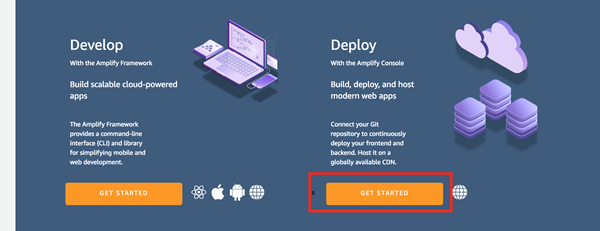
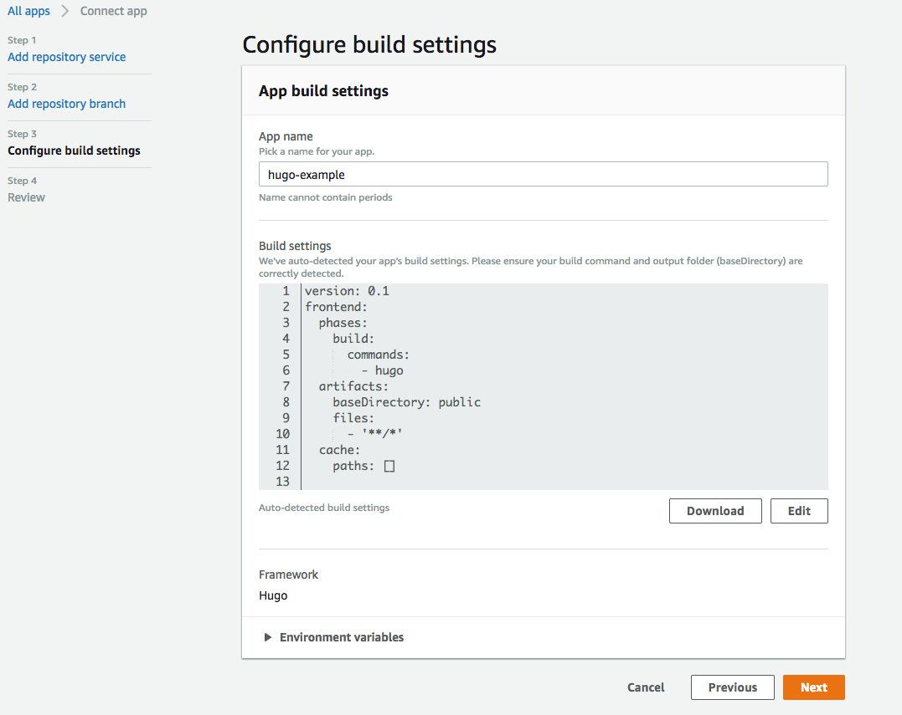

+++
title = "Host on AWS Amplify"
weight = 7
date = 2023-05-18T17:03:08+08:00
description = ""
isCJKLanguage = true
draft = false
+++

# Host on AWS Amplify

[https://gohugo.io/hosting-and-deployment/hosting-on-aws-amplify/](https://gohugo.io/hosting-and-deployment/hosting-on-aws-amplify/)

Develop and deploy a cloud-powered web app with AWS Amplify.

In this guide we’ll walk through how to deploy and host your Hugo site using the [AWS Amplify Console](https://console.amplify.aws/).

AWS Amplify is a combination of client library, CLI toolchain, and a Console for continuous deployment and hosting. The Amplify CLI and library allow developers to get up & running with full-stack cloud-powered applications with features like authentication, storage, serverless GraphQL or REST APIs, analytics, Lambda functions, & more. The Amplify Console provides continuous deployment and hosting for modern web apps (single page apps and static site generators). Continuous deployment allows developers to deploy updates to their web app on every code commit to their Git repository. Hosting includes features such as globally available CDNs, easy custom domain setup + HTTPS, feature branch deployments, and password protection.

## Pre-requisites 

- [Sign up for an AWS Account](https://portal.aws.amazon.com/billing/signup?redirect_url=https%3A%2F%2Faws.amazon.com%2Fregistration-confirmation). There are no upfront charges or any term commitments to create an AWS account and signing up gives you immediate access to the AWS Free Tier.
- You have an account with GitHub, GitLab, or Bitbucket.
- You have completed the [Quick Start](https://gohugo.io/getting-started/quick-start/) or have a Hugo website you are ready to deploy and share with the world.

## Hosting 

1. Log in to the [AWS Amplify Console](https://console.aws.amazon.com/amplify/home) and choose Get Started under Deploy.
2. Connect a branch from your GitHub, Bitbucket, GitLab, or AWS CodeCommit repository. Connecting your repository allows Amplify to deploy updates on every code commit to a branch.
3. Accept the default build settings. The Amplify Console automatically detects your Hugo build settings and output directory.
4. Review your changes and then choose **Save and deploy**. The Amplify Console will pull code from your repository, build changes to the backend and frontend, and deploy your build artifacts at `https://master.unique-id.amplifyapp.com`. Bonus: Screenshots of your app on different devices to find layout issues.

## Using a newer version of Hugo 

If you need to use a different, perhaps newer, version of Hugo than the version currently supported by AWS Amplify:

1. Visit the [AWS Amplify Console](https://console.aws.amazon.com/amplify/home), and click the app you would like to modify
2. In the side navigation bar, Under App Settings, click **Build settings**
3. On the Build settings page, near the bottom, there is a section called **Build image settings**. Click **Edit**
4. Under **Live package updates**, click **Add package version override**
5. From the selection, click **Hugo** and ensure the version field says `latest`
6. Click **Save** to save the changes.

## 另请参阅

- [Host on 21YunBox](https://gohugo.io/hosting-and-deployment/hosting-on-21yunbox/)
- [Host on Azure Static Web Apps](https://gohugo.io/hosting-and-deployment/hosting-on-azure/)
- [Host on GitHub](https://gohugo.io/hosting-and-deployment/hosting-on-github/)
- [Host on GitLab](https://gohugo.io/hosting-and-deployment/hosting-on-gitlab/)
- [Host on KeyCDN](https://gohugo.io/hosting-and-deployment/hosting-on-keycdn/)
