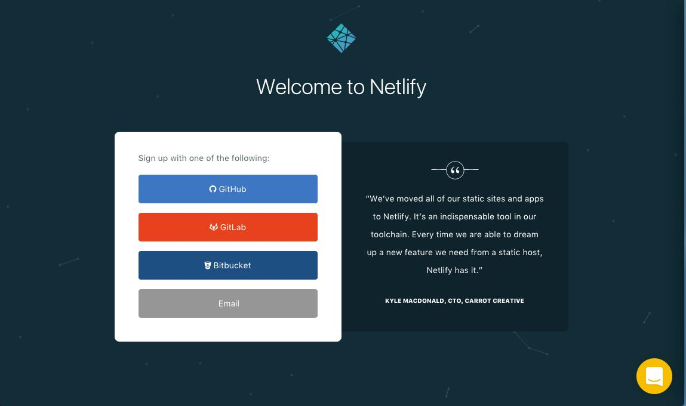
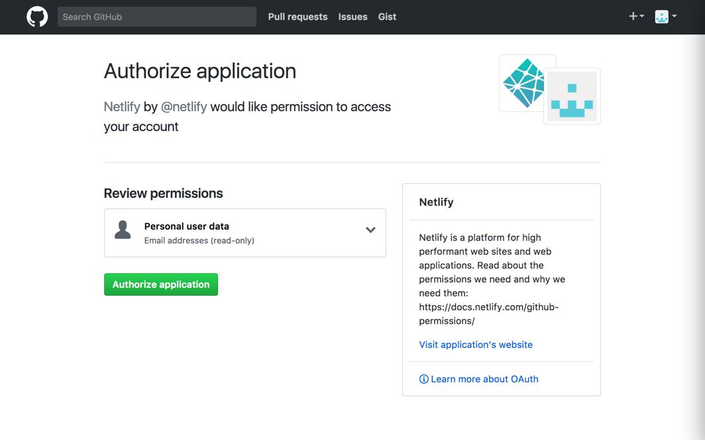
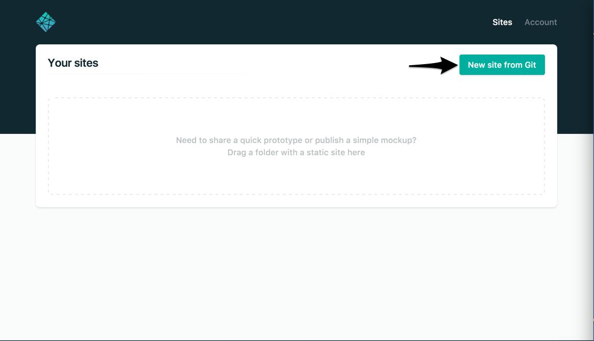
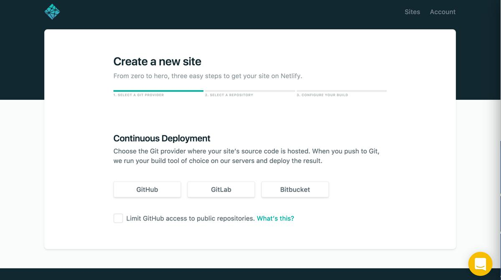
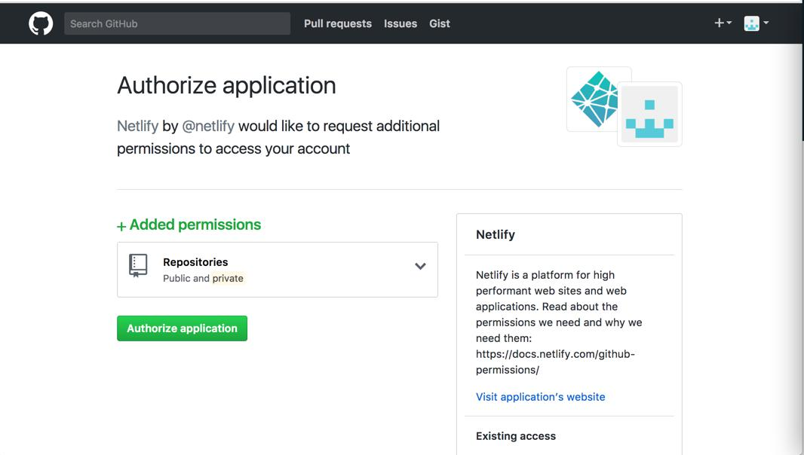
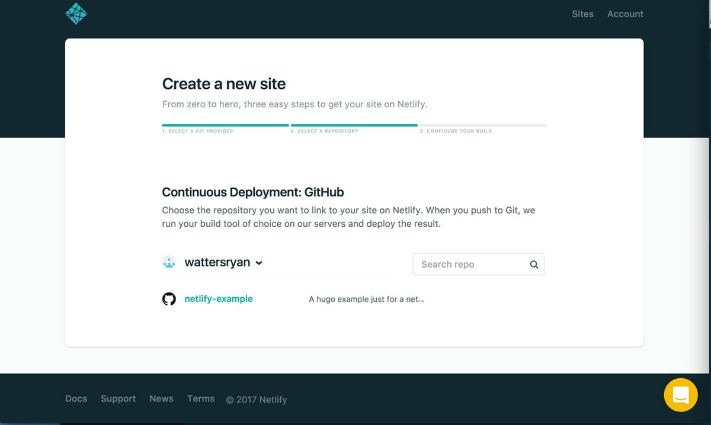
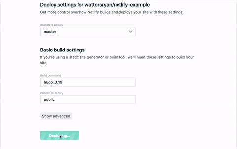
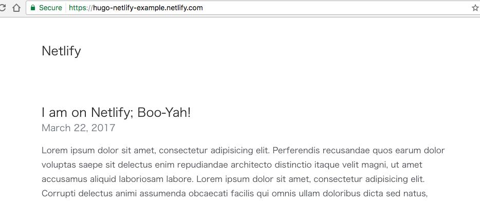

+++
title = "Host on Netlify"
weight = 7
date = 2023-05-18T17:03:08+08:00
description = ""
isCJKLanguage = true
draft = false
+++

# Host on Netlify

[https://gohugo.io/hosting-and-deployment/hosting-on-netlify/](https://gohugo.io/hosting-and-deployment/hosting-on-netlify/)

Netlify can host your Hugo site with CDN, continuous deployment, 1-click HTTPS, an admin GUI, and its own CLI.

[Netlify](https://www.netlify.com/) provides continuous deployment services, global CDN, ultra-fast DNS, atomic deploys, instant cache invalidation, one-click SSL, a browser-based interface, a CLI, and many other features for managing your Hugo website.

## Assumptions 

- You have an account with GitHub, GitLab, or Bitbucket.
- You have completed the [Quick Start](https://gohugo.io/getting-started/quick-start/) or have a Hugo website you are ready to deploy and share with the world.
- You do not already have a Netlify account.

## Create a Netlify account 

Go to [app.netlify.com](https://app.netlify.com/) and select your preferred signup method. This will likely be a hosted Git provider, although you also have the option to sign up with an email address.

The following examples use GitHub, but other git providers will follow a similar process.



Selecting GitHub will bring up an authorization modal for authentication. Select "Authorize application."



## Create a new site with continuous deployment 

You’re now already a Netlify member and should be brought to your new dashboard. Select "New site from git."



Netlify will then start walking you through the steps necessary for continuous deployment. First, you’ll need to select your git provider again, but this time you are giving Netlify added permissions to your repositories.



And then again with the GitHub authorization modal:



Select the repo you want to use for continuous deployment. If you have a large number of repositories, you can filter through them in real time using repo search:



Once selected, you’ll be brought to a screen for basic setup. Here you can select the branch you want to publish, your [build command](https://gohugo.io/getting-started/usage/#build-your-site), and your publish (i.e. deploy) directory. The publish directory should mirror that of what you’ve set in your [site configuration](https://gohugo.io/getting-started/configuration/), the default of which is `public`. The following steps assume you are publishing from the `master` branch.

## Configure Hugo version in Netlify 

You can [set Hugo version](https://www.netlify.com/blog/2017/04/11/netlify-plus-hugo-0.20-and-beyond/) for your environments in `netlify.toml` file or set `HUGO_VERSION` as a build environment variable in the Netlify console.

For production:

netlify.toml


```toml
[context.production.environment]
  HUGO_VERSION = "0.99.1"
```

For testing:

netlify.toml


```toml
[context.deploy-preview.environment]
  HUGO_VERSION = "0.99.1"
```

The Netlify configuration file can be a little hard to understand and get right for the different environment, and you may get some inspiration and tips from this site’s `netlify.toml`:

```toml
[build]
publish = "public"
command = "hugo --gc --minify"

[context.production.environment]
HUGO_VERSION = "0.111.3"
HUGO_ENV = "production"
HUGO_ENABLEGITINFO = "true"

[context.split1]
command = "hugo --gc --minify --enableGitInfo"

[context.split1.environment]
HUGO_VERSION = "0.111.3"
HUGO_ENV = "production"

[context.deploy-preview]
command = "hugo --gc --minify --buildFuture -b $DEPLOY_PRIME_URL"

[context.deploy-preview.environment]
HUGO_VERSION = "0.111.3"

[context.branch-deploy]
command = "hugo --gc --minify -b $DEPLOY_PRIME_URL"

[context.branch-deploy.environment]
HUGO_VERSION = "0.111.3"

[context.next.environment]
HUGO_ENABLEGITINFO = "true"

[[redirects]]
from = "/npmjs/*"
to = "/npmjs/"
status = 200
```

## Build and Deploy Site 

In the Netlify console, selecting "Deploy site" will immediately take you to a terminal for your build:.



Once the build is finished—this should only take a few seconds–you should now see a "Hero Card" at the top of your screen letting you know the deployment is successful. The Hero Card is the first element that you see in most pages. It allows you to see a quick summary of the page and gives access to the most common/pertinent actions and information. You’ll see that the URL is automatically generated by Netlify. You can update the URL in "Settings."




[Visit the live site](https://hugo-netlify-example.netlify.com/).

Now every time you push changes to your hosted git repository, Netlify will rebuild and redeploy your site.

See [this blog post](https://www.netlify.com/blog/2017/04/11/netlify-plus-hugo-0.20-and-beyond/) for more details about how Netlify handles Hugo versions.

## Use Hugo Themes with Netlify 

The `git clone` method for installing themes is not supported by Netlify. If you were to use `git clone`, it would require you to recursively remove the `.git` subdirectory from the theme folder and would therefore prevent compatibility with future versions of the theme.

A *better* approach is to install a theme as a proper git submodule. You can [read the GitHub documentation for submodules](https://github.com/blog/2104-working-with-submodules) or those found on [Git’s website](https://git-scm.com/book/en/v2/Git-Tools-Submodules) for more information, but the command is similar to that of `git clone`:

```txt
cd themes
git submodule add https://github.com/<THEMECREATOR>/<THEMENAME>
```

It is recommended to only use stable versions of a theme (if it’s versioned) and always check the changelog. This can be done by checking out a specific release within the theme’s directory.

Switch to the theme’s directory and list all available versions:

```txt
cd themes/<theme>
git tag
# exit with q
```

You can checkout a specific version as follows:

```txt
git checkout tags/<version-name>
```

You can update a theme to the latest version by executing the following command in the *root* directory of your project:

```txt
git submodule update --rebase --remote
```

## Next Steps 

You now have a live website served over HTTPS, distributed through CDN, and configured for continuous deployment. Dig deeper into the Netlify documentation:

1. [Using a Custom Domain](https://www.netlify.com/docs/custom-domains/)
2. [Setting up HTTPS on Custom Domains](https://www.netlify.com/docs/ssl/)
3. [Redirects and Rewrite Rules](https://www.netlify.com/docs/redirects/)

## 另请参阅

- [Host on GitLab](https://gohugo.io/hosting-and-deployment/hosting-on-gitlab/)
- [Host on Azure Static Web Apps](https://gohugo.io/hosting-and-deployment/hosting-on-azure/)
- [Host on KeyCDN](https://gohugo.io/hosting-and-deployment/hosting-on-keycdn/)
- [Host on Render](https://gohugo.io/hosting-and-deployment/hosting-on-render/)
- [Hugo Deploy](https://gohugo.io/hosting-and-deployment/hugo-deploy/)
